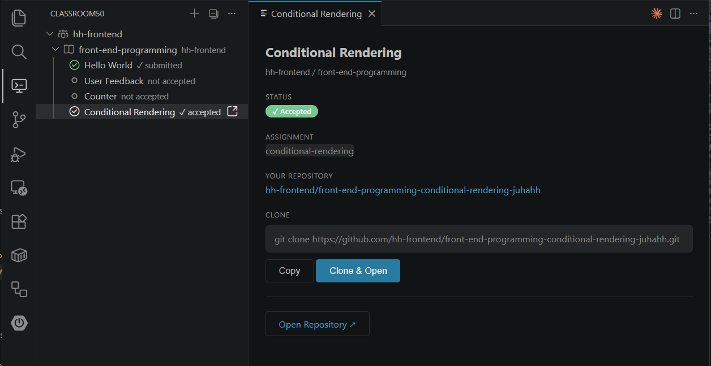

# Classroom50 Student extension

Classroom 50 is an open-source GitHub Classroom alternative developed by the Fifty Foundation.

This extension is designed for students using Classroom50 courses.

## Features
- **GitHub Authentication**: GitHub login integration for accessing your classroom data
- **Manage Organizations**: Add and manage GitHub organizations at the top level to access your classrooms
- **Browse Classrooms**: View all classrooms within each organization
- **View Assignments**: Browse assignments for each classroom in a tree view
- **Accept Assignments**: Accept assignments directly from VS Code with one click
- **Clone Assignments**: Clone assignment repositories with Git URLs

## Prerequisites

- **GitHub Account**: You need a GitHub account
- **Organization Membership**: You must be a member of the organization where your classrooms are located
- **Teacher Setup**: Your teacher must have added you as a member of the GitHub organization to access the classrooms and assignments within it

## Getting started

1. Install this extension and reload VS Code
2. Click on the Classroom50 tab in the activity bar
3. Click the **Sign in to Github** and complete the sign process, using your GitHub account. 

## Organizations

Classroom50 uses GitHub organizations for classes. You must be a member of the organization you want to use.

Press **Add organization...** to open the list of organizations you belong to, then select one from the list.

## Classrooms

Organization can contain multiple classrooms. You can select which classrooms you want to show.

Use **Add classroom...** to open the classroom list for that organization and select one or more classrooms to add.

## Assignments

Open the classroom in the tree view to see the list of assignments.

###  Accept assignment

The ***not accepted*** status means you must accept the assignment before you can work on it.

Click the assignment in the tree view to open it in its own view.

Press the **Accept Assignment** button to accept the assignment.

### Accepted assignment

After you accept the assignment, its status changes to ***accepted***. 

In accepted assignments, these buttons are available:

- **Open Repository ↗**: Opens your assignment repository on GitHub in the browser.
- **Copy**: Copies the full clone command (`git clone <repo-url>.git`) to your clipboard.
- **Clone & Open**: Starts cloning that assignment repository in VS Code.

This extension does not provide a separate submit action. Submitting is done with standard Git commands: commit and push.

### Submitted assignment

After you submit the assignment, its status changes to ***submitted***. You can view the autograding result, if available, in the assignment view.

> [!NOTE]
> Submission takes some time because Classroom50 uses GitHub workflows for autograding. Refresh the view after a few minutes to see the submission result. You can use Refresh from the ... menu.

