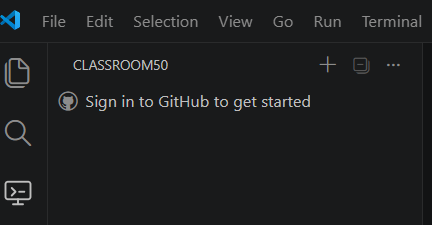
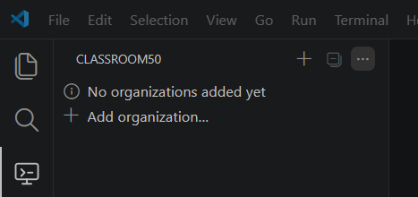
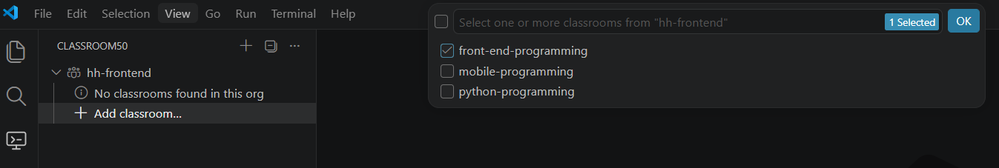
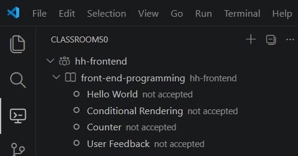
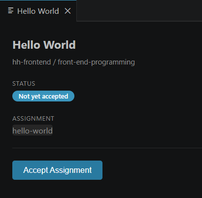
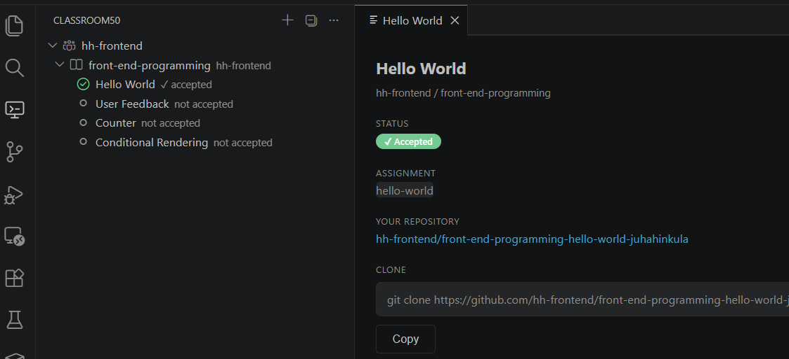
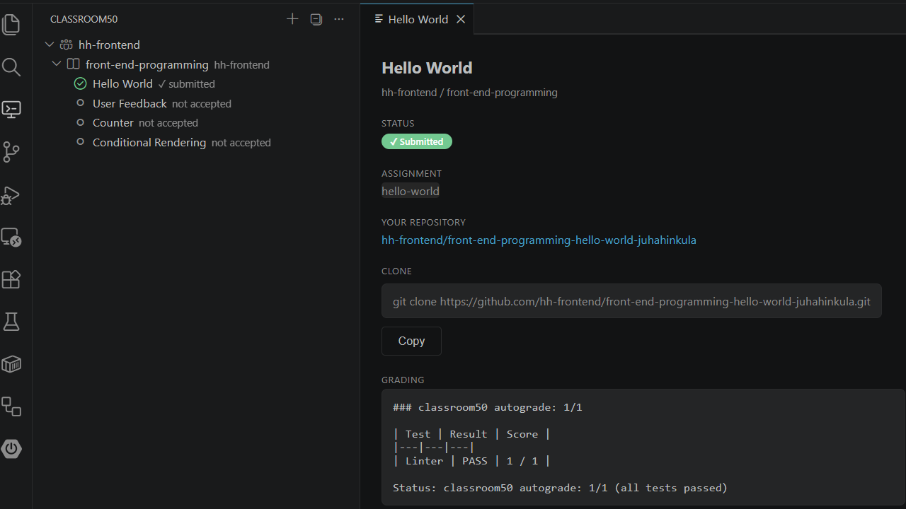
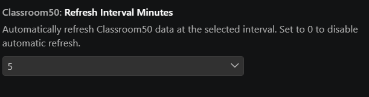

# Classroom50 Student extension

Classroom 50 is an open-source GitHub Classroom alternative developed by the Fifty Foundation.

This extension is designed for students using Classroom50 courses.

## Features
- **GitHub Authentication**: GitHub login integration for accessing your classroom data
- **Manage Organizations**: Add and manage GitHub organizations at the top level to access your classrooms
- **Browse Classrooms**: View all classrooms within each organization
- **View Assignments**: Browse assignments for each classroom in a tree view
- **Accept Assignments**: Accept assignments directly from VS Code with one click
- **Clone Assignments**: Clone assignment repositories with Git URLs

## Prerequisites

- **GitHub Account**: You need a GitHub account
- **Organization Membership**: You must be a member of the organization where your classrooms are located
- **Teacher Setup**: Your teacher must have added you as a member of the GitHub organization to access the classrooms and assignments within it

## Getting started

1. Install this extension and reload VS Code
2. Click on the Classroom50 tab in the activity bar
3. Click the **Sign in to Github** and complete the sign process, using your GitHub account. 

## Organizations

Classroom50 uses GitHub organizations for classes. You must be a member of the organization you want to use.

Press **Add organization...** to open the list of organizations you belong to, then select one from the list.

## Classrooms

Organization can contain multiple classrooms. You can select which classrooms you want to show.

Use **Add classroom...** to open the classroom list for that organization and select one or more classrooms to add.

### Unlisted classrooms

Some classrooms are **unlisted**. In unlisted classrooms, assignment files are not available at the normal public URL.

If this happens, the extension asks for a **Classroom Access Key** when you accept an assignment.

How to get the key:
1. Open the invitation link your teacher shared (LMS/email/chat).
2. Find `?k=...` in the link.
3. Copy the value after `?k=` and paste it into the prompt.

Example invitation link:

`https://<org>.github.io/classroom50/<classroom>/assignments/<assignment>/accept?k=abc123xy`

In this example, the access key is `abc123xy`.

### Removing organizations or classrooms

You can remove items from the Classroom50 extension view when you no longer want to see them.

How to remove an organization:
1. Select the organization in the tree view.
2. Click the trash bin icon (**Remove Organization**).
3. Confirm the removal.

How to remove a classroom:
1. Select the classroom in the tree view.
2. Click the trash bin icon (**Remove Classroom**).
3. Confirm the removal.

> **Important**
> This removal is only local to VS Code.
> It does **not** delete anything from GitHub.
> Organizations, classrooms, repositories, and assignments remain unchanged on GitHub.

## Assignments

Open the classroom in the tree view to see the list of assignments.

###  Accept assignment

The ***not accepted*** status means you must accept the assignment before you can work on it.

Click the assignment in the tree view to open it in its own view.

Press the **Accept Assignment** button to accept the assignment.

### Accepted assignment

After you accept the assignment, its status changes to ***accepted***. 

In accepted assignments, these buttons are available:

- **Open Repository ↗**: Opens your assignment repository on GitHub in the browser.
- **Copy**: Copies the full clone command (`git clone <repo-url>.git`) to your clipboard.
- **Clone & Open**: Opens a folder selection prompt in VS Code, then clones that assignment repository into the selected location.

This extension does not provide a separate submit action. Submitting is done with standard Git commands: commit and push.

### Group assignments

Group assignments are supported in the accept flow.

For group assignments, one student accepts first and becomes the repository founder.
In the extension assignment view, the founder sees a **Manage Collaborators** button.
This button opens the repository collaborator settings on GitHub.

How to manage teammates for a group assignment:
1. Open the group assignment in the extension.
2. Click **Manage Collaborators**.
3. On GitHub, add or remove collaborators in repository settings.

Only the group founder (the student who accepted the assignment) sees this button.
Group members can ask their founder to manage collaborators.

> **Note**
> Group members must be in the same GitHub organization and enrolled in the classroom.

### Submitted assignment

After you submit the assignment, its status changes to ***submitted***. You can view the autograding result, if available, in the assignment view.

> **Note**
> Submission takes some time because Classroom50 uses GitHub workflows for autograding. Refresh the view after a few minutes to see the submission result. You can use Refresh from the ... menu. You can also set automatic refresh in the extension settings.

## Extension Settings

- **classroom50.refreshIntervalMinutes**: Automatic refresh interval for the tree view. Default is `0` (Off).

How to change settings:

1. Open **Settings** --> **Extensions**.
2. Search for **Classroom50**.
3. Set **Refresh Interval Minutes** to one of: 0 (=Off), 1, 5, 10, 15, 30, or 60.

---
Extension icon by [Icons8.com](https://www.icons8.com)